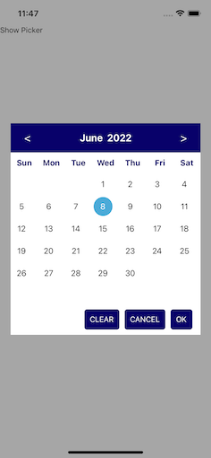
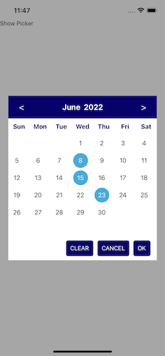
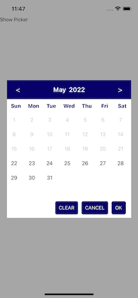

# React Native Date Picker

This package will help to pick a single date and multiple dates in react native.

# Attachments
     

## Required Package
```
npm install @react-native-picker/picker --save
```
```
yarn add @react-native-picker/picker
```

Check the link [here](https://github.com/react-native-picker/picker)


## Installation

```
yarn add react-native-easy-date-picker
```

or

```
npm install react-native-easy-date-picker --save
```

## Example


### Code

```js
import React, { useRef } from 'react';
import {
  SafeAreaView,
  View,
  Text
} from 'react-native';
import CalendarDatePicker from './src/CalendarDatePicker';


const ExampleOne = () => {
  const calendarDatePicker = useRef();

  const getSelectedDates = (selectedDates) => {
    console.log('hello', selectedDates)
  }

  return (
    <SafeAreaView style={{ flex: 1 }}>

      <View
        style={{ flex: 1, alignItems: "center", justifyContent: 'center' }}>
        <Text onPress={() => {
          calendarDatePicker.current.handleShow()
        }}>{'Show Picker'}</Text>

        <CalendarDatePicker
          ref={calendarDatePicker}
          getSelectedDates={getSelectedDates}
          multiSelect={true}
          maxNumOfDateSel={6}
          checkbefToday={true}
        />


      </View>

    </SafeAreaView>
  );
};


export default ExampleOne;

```

Check the code [here](./examples/ExampleOne.js)


## Props

| Prop                            |              Default               |      Type       | Description                                |
| :------------------------------ | :--------------------------------: | :-------------: | :----------------------------------------- |
| ref                             |                                    | `reference`     | Data to use in renderSectionList           |
| multiSelect                     |       false                        |`boolean`        | number of item per row                     |
| checkbefToday                   |       false                          |`boolean`      | style of grid item view                    |
| maxNumOfDateSel                 |        -1                           |`number`        | style of entire listview                   |

## Instance Methods
| Method        | Params          | Description      |
| :------------ |:---------------:| :---------------:|
| getSelectedDates | array | return selected dates   |

## Author

Loganathan Rajamani
